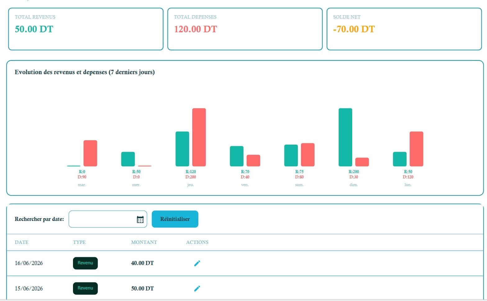
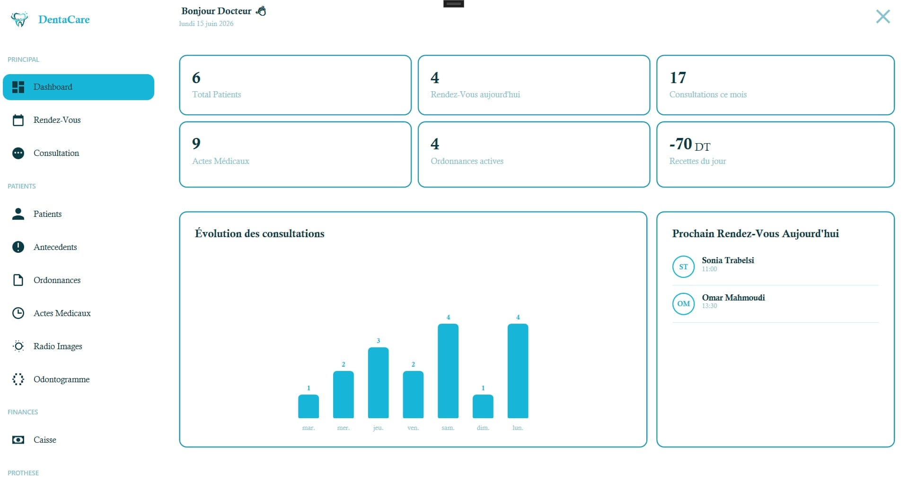
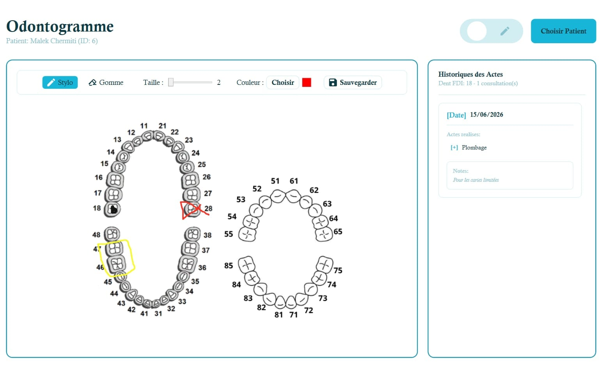
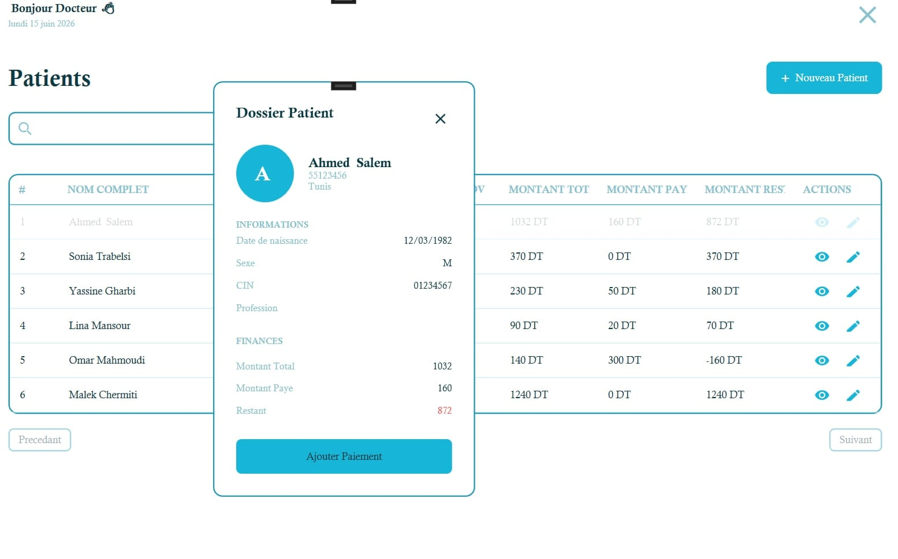
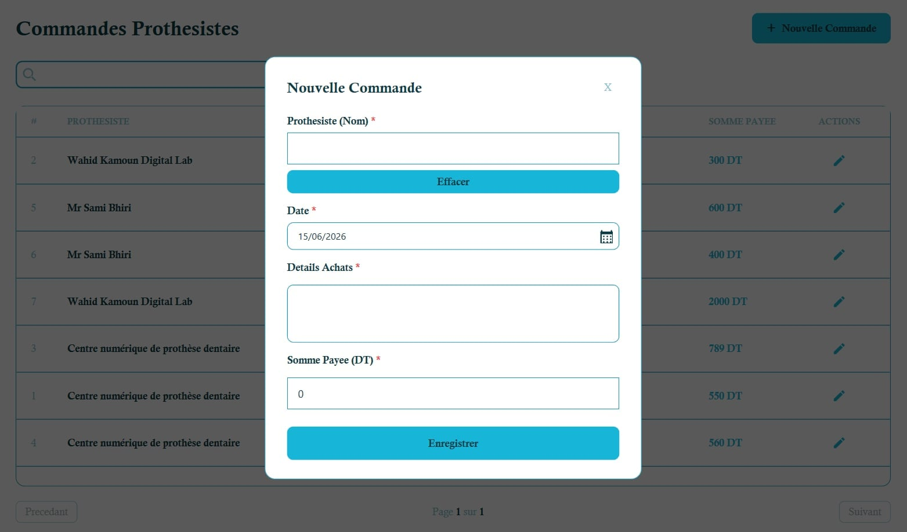
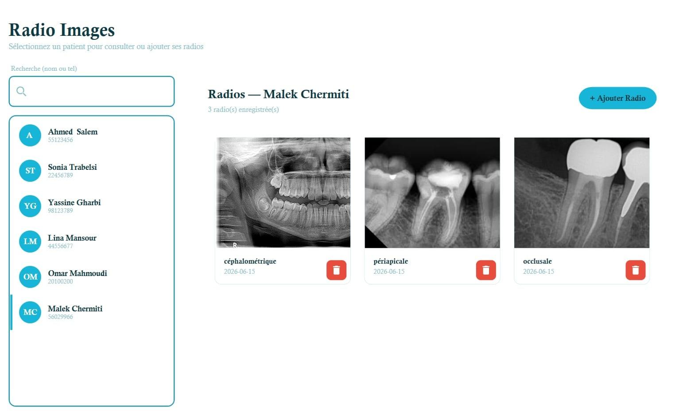
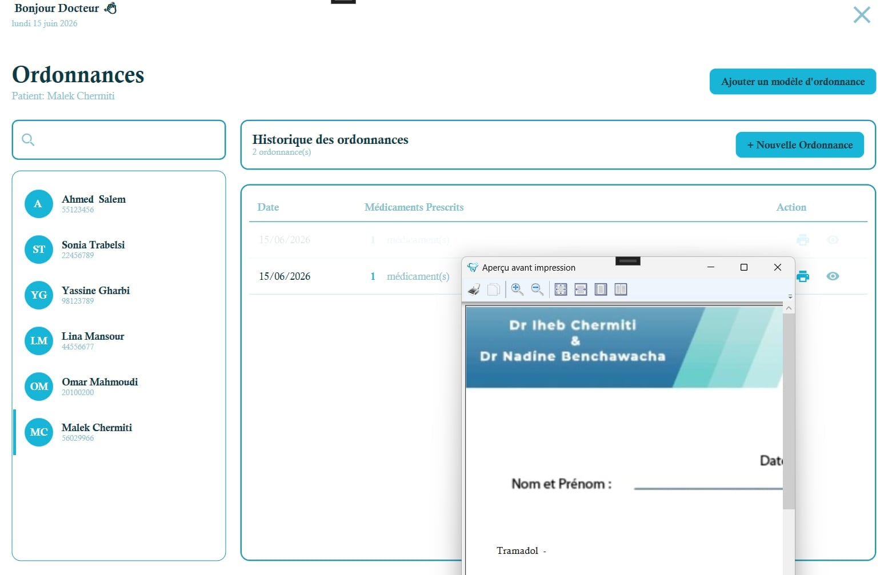
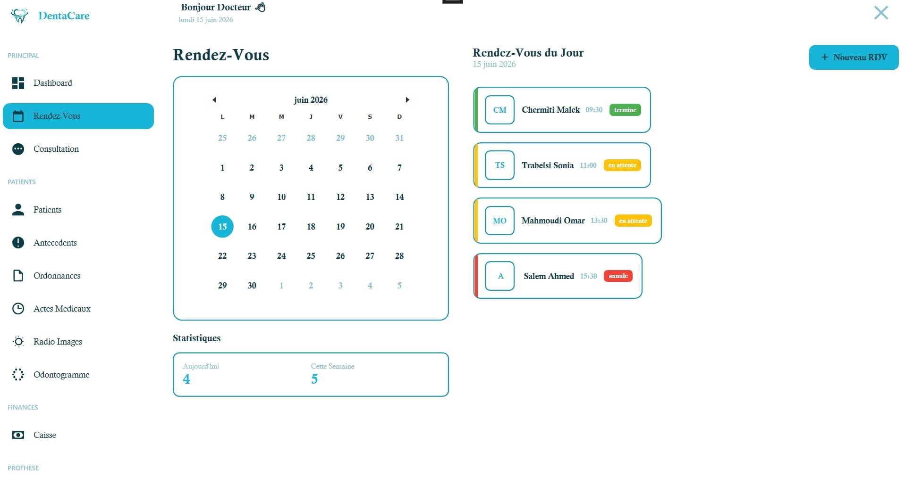

# Dental App

A modern desktop management application for dental clinics built with WPF and .NET 8. The application provides patient management, consultations, odontogram editing, financial caisse tracking, prosthetist orders and more — designed for small to medium dental practices.

---

## Key Features

- Patient management (create, search, appointments, history)
- Consultation and treatment tracking
- Interactive odontogram editor with drawing tools and history
- Financial module (Caisse) with daily revenue/expense tracking and 7-day charts
- Prosthetist orders and supplier management
- Simple notifications and confirmation dialogs
- Local persistence using SQLite and Entity Framework Core
- MVVM architecture with Prism for modularity and testability

---

## Technology Stack

- .NET 8 (WPF)
- Prism (MVVM)
- Entity Framework Core with SQLite
- C# 12

---

## Screenshots

Below are representative screenshots from the application (files included in `docs/`).

- Financial dashboard / Caisse

  

- Main dashboard

  

- Odontogram editor

  

- Patients list

  

- Prosthetist list

  

- Radiographs / Radio images view

  

- Example ordonnance screen

  

- Appointments / Rendez-vous

  

---

## Running Locally

Prerequisites:
- .NET 8 SDK installed
- A Windows machine for WPF desktop UI

Steps:

1. Clone the repository:

   `git clone https://github.com/MalekToumi-815/Dental-App.git`

2. Open the solution in Visual Studio 2022/2023 or Visual Studio Code (with C# extensions).

3. Restore NuGet packages and build the solution.

4. Run the `Dental App` project (WPF application).

Notes:
- The app uses a local SQLite file for storage. On first run the database will be created/migrated automatically.

---

## Project Structure (high level)

- `Dental App` — WPF project containing Views, ViewModels, Services, Models and EF migrations
- `Views` — XAML UI definitions
- `ViewModels` — MVVM view logic (Prism DelegateCommands, navigation)
- `Services` — Application services (data access, business rules)
- `Models` — EF Core entities
- `Migrations` — EF Core migrations for database schema

---

## Contributing

Contributions, bug reports and feature requests are welcome. Please open an issue or submit a pull request. Follow the existing code style (MVVM + Prism) and include descriptive commit messages.

When adding screenshots, place them in `docs/` and reference them in this README.

---